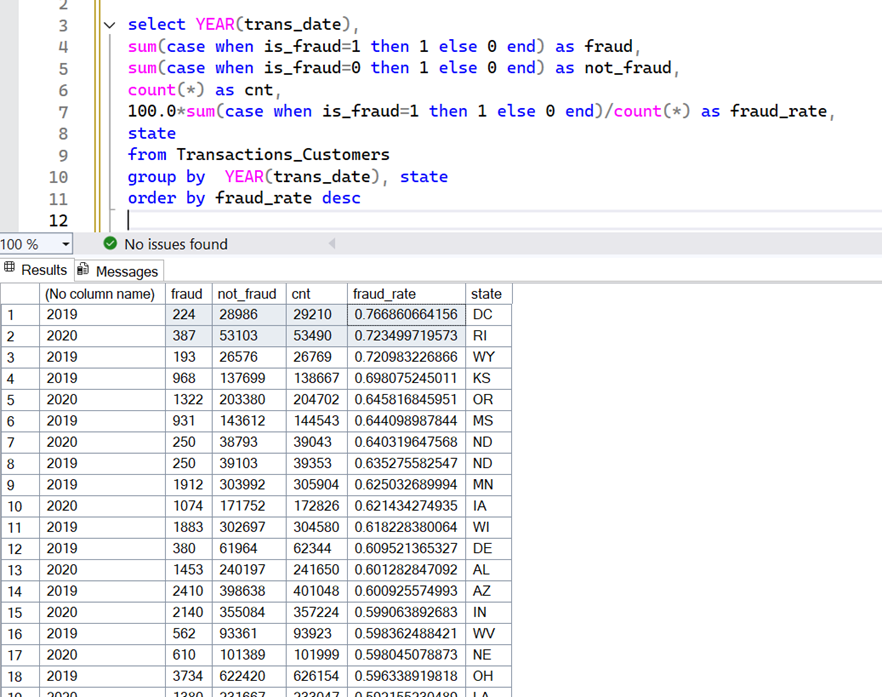

# Fraud Detection
Fraud Detection Project

Introduction:
---

In this project, we analyze transaction data to identify fraud. 
Early detection of fraud can save costs and prevent damage to customers and financial institutions.

Data source: 
Kaggle. 
The original file contains about 34 million records; 
Since a preliminary examination showed that the fraud rates in this Washington, D.C were the highest, in 2019
I decided to filter the data for focused analysis.

Below is the analysis:

I saved the resulting data in a CSV file called Transactions_Customers_DC_2019.csv 
The file was uploaded to Google Drive so any one could work with it.

the notbooks are:
1 - prep
2 - EDA
3 - outliers + imbalanced

